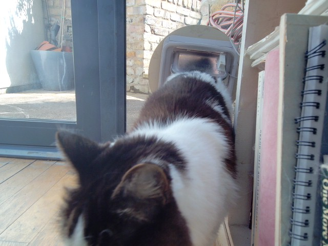

# Tweeting Cat Flap



## Overview

TODO, what is this and what do you need to use it?

## Install the Operating System

* Install a fresh copy of [Raspberry Pi OS Desktop 64 bit edition](https://www.raspberrypi.com/software/) on the Raspberry Pi 4.
* Configure your wifi details or connect an ethernet cable to the Raspberry Pi.  If you're using the official [Raspberry Pi Imager](https://www.raspberrypi.com/news/raspberry-pi-imager-imaging-utility/), you can configure your wifi details whilst installing the operating system.

## Configure the Operating System

Once you have your Raspberry Pi up and running, it should display a graphical desktop environment.  You need to configure a few things...

Start the terminal and enter the following command:

```bash
sudo raspi-config
```

The Raspberry Pi configuration application appears.  You should:

* Choose menu option 6 (Advanced Options). 
* Choose menu option A1 (Expand Filesystem).
* Click "OK" when you see the message saying "Root partition has been resized."
* Choose "Finish" to exit the raspi-config utility.
* Choose "Yes" when asked "Would you like to reboot now?"

Allow the Pi to reboot.

## Get the Operating System up to Date

Start the terminal and enter the following command:

```bash
sudo apt update
```

Then (this one may take some time, answer "Y" to any questions it asks):

```bash
sudo apt upgrade
```

Reboot the Pi when it has finished:

```bash
sudo reboot
```

## Check that Required Software is Installed

When it has rebooted, start the terminal and check the Python version with the following command:

```bash
python --version
```

At the time of writing this outputs `Python 3.11.2`.  `3.11.<anything>` is good.

Now check the version of Pip (a Python package manager):

```bash
pip --version
```

At the time of writing this outputs:

```bash
pip 23.0.1 from /usr/lib/...
```

`23.<anything>` is good.

Finally, check that the git command line tools are installed:

```bash
git --version
```

Should return something like `git version 2.39.2`.  Any version is fine!

## Install the Web Cam Software

This project uses a USB web camera, which needs some additional software that doesn't come with Raspberry Pi OS.  From the terminal, enter the commands:

```bash
sudo apt install fswebcam
```

then

```bash
sudo apt install gir1.2-peas-1.0
```

Connect the camera to one of the USB ports on the Pi.

Now test the camera.  Enter the command:

```bash
fswebcam --no-banner --gmt --delay 0.5 --resolution 2048x1536 --save capture.jpg --skip 2
```

You should see output ending in `Writing JPEG image to 'capture.jpg'.`.  Make sure `capture.jpg` contains a decent image:

```bash
open capture.jpg
```

Once you've verified that the image is good, delete it:

```bash
rm capture.jpg
```

## Install Python Libraries

Install the extra Python libraries needed for the project.  Enter the following command at the terminal:

```bash
sudo apt install python3-twython
```

## Install the Daphne Flap Project

Now it's time to get the code for the project from GitHub and install it on the Raspberry Pi.  At the terminal, type the following commands:

```bash
cd ~/Desktop
git clone https://github.com/simonprickett/tweeting-catflap.git
cd tweeting-catflap
```

Keep this terminal open.  The sections that follow assume that you have a terminal open with the current directory being `~/Desktop/tweeting-catflap`.

## Test the Camera with the Project Script

Enter the following command at the terminal:

```bash
./capture-image.sh
```

Now make sure `capture.jpg` contains a decent image:

```bash
open capture.jpg
```

Once you've verified that the image is good, delete it:

```bash
rm capture.jpg
```

## Configure the Project for Twitter API Access

TODO

## Plug in the Cat Flap

TODO

## Start the Project

TODO

## Periodic Maintenance

TODO
