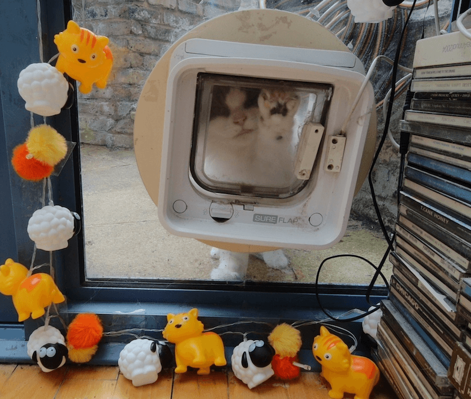

# Tweeting Cat Flap



This is an extension of the original tweeting-catflap project by Bernie Sumption ([original project repository](https://github.com/BernieSumption/tweeting-catflap)).

Follow Daphne's comings and goings on [Bluesky](https://bsky.app/profile/daphnethecat.com) and, historically, on the original [Twitter account](https://x.com/DaphneFlap).

## Overview

TODO, what is this and what do you need to use it?

## Install the Operating System

* Install a fresh copy of [Raspberry Pi OS Desktop 64 bit edition](https://www.raspberrypi.com/software/) on the Raspberry Pi 4 or 5.
* Configure your wifi details or connect an ethernet cable to the Raspberry Pi.  If you're using the official [Raspberry Pi Imager](https://www.raspberrypi.com/news/raspberry-pi-imager-imaging-utility/), you can configure your wifi details whilst installing the operating system.

## Configure the Operating System

Once you have your Raspberry Pi up and running, it should display a graphical desktop environment.  You need to configure a few things...

Start the terminal and enter the following command:

```bash
sudo raspi-config
```

The Raspberry Pi configuration application appears.  If you are booting from an SD card (ignore this if you have an SSD), you should:

* Choose menu option 6 (Advanced Options). 
* Choose menu option A1 (Expand Filesystem).
* Click "OK" when you see the message saying "Root partition has been resized."
* Choose "Finish" to exit the raspi-config utility.
* Choose "Yes" when asked "Would you like to reboot now?"

Allow the Pi to reboot.

## Get the Operating System up to Date

Start the terminal and enter the following command:

```bash
sudo apt update
```

Then (this one may take some time, answer "Y" to any questions it asks):

```bash
sudo apt upgrade
```

Reboot the Pi when it has finished:

```bash
sudo reboot
```

## Check that Required Software is Installed

When it has rebooted, start the terminal and check the Python version with the following command:

```bash
python --version
```

At the time of writing this outputs `Python 3.13.5`.  `3.13.<anything>` is good.

Now check the version of Pip (a Python package manager):

```bash
pip --version
```

At the time of writing this outputs:

```bash
pip 25.1.1 from /usr/lib/...
```

`25.<anything>` is good.

Finally, check that the git command line tools are installed:

```bash
git --version
```

Should return something like `git version 2.47.3`.  Any version is fine!

## Install the Web Cam Software

This project uses a USB web camera, which needs some additional software that doesn't come with Raspberry Pi OS.  From the terminal, enter the commands:

```bash
sudo apt install fswebcam
```

then

```bash
sudo apt install gir1.2-peas-1.0
```

then

```bash
sudo apt install python3-lgpio
```

Connect the camera to one of the USB ports on the Pi.

Now test the camera.  Enter the command:

```bash
fswebcam --no-banner --gmt --delay 0.5 --resolution 2048x1536 --save capture.jpg --skip 2
```

You should see output ending in `Writing JPEG image to 'capture.jpg'.`.  Make sure `capture.jpg` contains a decent image:

```bash
open capture.jpg
```

Once you've verified that the image is good, delete it:

```bash
rm capture.jpg
```

## Install the Daphne Flap Project

Now it's time to get the code for the project from GitHub and install it on the Raspberry Pi.  At the terminal, type the following commands:

```bash
cd ~/Desktop
git clone https://github.com/simonprickett/tweeting-catflap.git
cd tweeting-catflap
```

Keep this terminal open.  The sections that follow assume that you have a terminal open with the current directory being `~/Desktop/tweeting-catflap`.

## Create and Activate a Python Virtual Enviroment

To ensure that the Python libraries we need to install run in a clean environment and don't affect other Python projects or the operating system, we're going to create and activate a Virtual Environment.

Enter the following commands:

```bash
python -m venv venv --system-site-packages
```

(this may take a few seconds to complete, and will produce no output).

```bash
. ./venv/bin/activate
```

(note the leading `.` - this is not a mistake!).

Your command prompt should now begin with `(venv)` showing that you're working in a Python virtual environment.

## Install Python Libraries

Install the extra Python libraries needed for the project.  Enter the following command at the terminal:

```bash
pip install -r requirements.txt
```

(this may take some time to complete).

## Test the Camera with the Project Script

Enter the following command at the terminal:

```bash
./capture-image.sh
```

Now make sure `capture.jpg` contains a decent image:

```bash
open capture.jpg
```

Once you've verified that the image is good, delete it:

```bash
rm capture.jpg
```

## Configure the Project for Bluesky API Access

You will need your login and password for Bluesky.  Add them to `settings.py` by adding the following lines then saving your changes:

```python
bluesky_user="<YOUR USER NAME OR DOMAIN e.g. simonprickett.bsky.social>"
bluesky_pass="<YOUR PASSWORD>"
post_bluesky=True
```

If you are using MFA on your Bluesky account (you should be) then you should create a separate App Password for this project and use that here.

## Configure the Project for Twitter API Access

TODO - this is also now legacy and won't be updated.

```bash
python twitter_auth.py --key YOUR_KEY_HERE --secret YOUR_SECRET_HERE
```

TODO

```bash
{'oauth_token': '**REDACTED**', 'oauth_token_secret': '**REDACTED**', 'oauth_callback_confirmed': 'true', 'auth_url': 'https://api.twitter.com/oauth/authenticate?oauth_token=**REDACTED**'}
Created settings.py
```

TODO

```bash
cat settings.py
```

TODO

```python
app_key="**REDACTED**"
app_secret="**REDACTED**"
oauth_token="**REDACTED**"
oauth_token_secret="**REDACTED**"
post_twitter=True
```

Treat these values like passwords.  Don't share them or commit them to GitHub.

## Plug in the Cat Flap and Test that it Triggers the Pi

TODO wiring instructions and sample image.

Once you have everything wired up, turn the Pi back on and let it boot.  Start a new Terminal session and enter the following commands:

```bash
cd ~/Desktop/tweeting-catflap
. ./venv/bin/activate
python gpio_watcher.py
```

Hopefully, opening and closing the cat flap causes the code to output `Change detected!`.  If it does, then exit back to the command prompt by pressing Ctrl-C.  If you don't see any output, check the wiring and pin selection on the Raspberry Pi carefully, make any necessary adjustments and try again.

## Start the Project

```bash
cd ~/Desktop/tweeting-catflap
```

If you haven't already activated the Python virtual environment (it's active when your prompt begins `(venv)`), activate it:

```bash
. ./venv/bin/activate
```

The first time you start the project, create a `history` folder where old pictures will be stored.

```bash
mkdir history
```

Now, start the project:

```bash
python main.py
```

All being well, when you trigger the cat flap you should see output similar to this:

```
Activating Paparazzo at 2026-04-09--20-36-30
Message: So arrives the ineffable Daphne, how noble is your imperial demeanour. It is my pleasure to let you past.
Posted to Bluesky.
```

And hopefully a new Tweet on the Twitter account's timeline and in Bluesky, depending on which social network posts are enabled in `settings.py`. The example above only has Bluesky enabled.

Stop the project by pressing Ctrl-C.

## Set the Project to Run Automatically when the Pi Boots

To set up the project as a service that runs automatically on boot, follow the instructions in [`start_on_boot_instructions.md`](./start_on_boot_instructions.md).

## Periodic Maintenance

You'll want to periodically delete old images from the `history` folder to make sure you don't overflow the Pi's storage (although with modern SD cards or SSDs this would take a long time).
